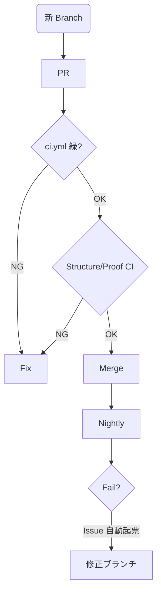

## 立体ポートフォリオ戦略 **v 7.1 – “Self-Driving Structure” 版**  
更新日 : 2025-05-04  
作者  : kwstyk / ChatGPT (o3)

> **キャッチフレーズ** : `git clone → Codespaces 1-click → just up — 5 min 体験・10 min 深掘り・24 h 自動検証／自己修復`
>
> **この 1 ファイルだけ読めば、設計思想・リポジトリ構造・運用フロー・ロードマップまで把握できます。**  
> 実装規約の詳細は別冊 **「ポートフォリオ構成仕様書」** を参照。

---

### 0. ドキュメント体系

| 種別 | 目的 | ファイル |
| ---- | ---- | -------- |
| **本書 v 7.1** | 上位戦略・哲学・改善サイクル | **`docs/strategy.md`** |
| ポートフォリオ構成仕様書 | ディレクトリ規約 / コンポーネント粒度 | `docs/architecture-spec.md` |
| why.md | 各 Proof の設計判断 | `proofs/**/why.md` |

---

### 1. 設計哲学 & 技術スタック（変更差分）

| 軸 | v 7.0 | **v 7.1 変更** |
| --- | ----- | -------------- |
| **UX 4層** | Landing→Structure→Proof→Story | 変更なし |
| **Structure** | 静的カード | **`categories.json` + 動的ルーティング** |
| **Layout** | `title` 単一 | **`siteName` / `pageTitle` 分離** |
| **Atomic Design** | atoms/molecules/organisms/templates | 同左・Card バッジ拡張 |
| **CI階層** | ci.yml / proof-ci.yml / nightly.yml | 同左（Proof-CI/Nightly は次フェーズで強化） |

---

### 2. リポジトリ全体構成 *(2025-05 現在)*

```text
kwstyk-portfolio/
├─ .github/workflows/
│   ├─ ci.yml              # Lint / type-check
│   ├─ proof-ci.yml        # Proof 再現 & Security (予定)
│   └─ nightly.yml         # Lighthouse / Trivy / Link-check (予定)
├─ devcontainer.json / Dockerfile   # Codespaces & local VS Code
├─ src/
│   ├─ data/categories.json          # ★ Structure カード定義
│   ├─ content/proofs/**.mdx         # Proof コレクション
│   ├─ pages/
│   │   ├─ index.astro               # Landing
│   │   ├─ structure/index.astro     # カード一覧 (自動生成)
│   │   ├─ structure/[slug].astro    # カテゴリ詳細 (動的)
│   │   └─ proof/[...slug].astro     # Proof 動的
│   ├─ components/ (Atomic)          # Card.astro など
│   ├─ layouts/Layout.astro          # siteName/pageTitle 分離
│   └─ styles/
├─ proofs/ <category>/<proof>/…      # 再現用ファイル
├─ docs/ strategy.md, architecture-spec.md…
├─ tools/  anki-gen, rss-to-json.ts (予定)
└─ scripts/ justfile, gen_onepager.py など
```

---

### 3. レイヤ別仕様（最新版）

#### 3-1 Landing

*Hero (Asciinema demo) / Pick3 / Progress Dashboard / CTA*

#### 3-2 Structure ★更新

| 項目 | 内容 |
| ---- | ---- |
| データ | `data/categories.json` に `id,slug,title,description,icon,badge,color` |
| 一覧 | `<Card>` を map 生成（アイコン・色付きバッジ） |
| ルート | `/structure/` → `/structure/{slug}/` (動的) |
| 詳細 | `Layout` の `siteName="KWSTYK Portfolio" pageTitle="Structure | {title}"` |

#### 3-3 Proof (v 1.1 要件据え置き)

| 要素 | 決定事項 |
| ---- | -------- |
| front-matter | `difficulty, repro[], stack[], updated, ci_status, stories[]` |
| テンプレート | `ProofHero → ProofMetaCard → MDX Body` |
| 再現バッジ | 🐳 Docker / 🏗 Terraform / 📦 Vagrant / 🔧 Manual |

#### 3-4 Story (次フェーズ)

| 項目 | 方針 |
| ---- | ---- |
| データ | Zenn / Note RSS → `stories.json` 自動生成 |
| UI | Timeline / Card 一覧 │

---

### 4. CI/CD & 品質ゲート

| Workflow | 主チェック | 合格基準 |
| --------- | --------- | -------- |
| ci.yml | `pnpm lint && pnpm typecheck && astro build` | Error 0 |
| proof-ci.yml | 再現 build, Trivy/Grype (予定) | Critical/High 0 |
| nightly.yml | Lighthouse ≥95, dead-link 0 (予定) | Slack 通知 |

---

### 5. 自動生成・ツール

| ツール | 概要 |
| ------ | ---- |
| `rss-to-json.ts` | Zenn/Note RSS → `stories.json` 生成（次フェーズ） |
| `gen_onepager.py` | `progress.json` → One-Pager.pdf (CI Artifact) |
| `anki-gen` | Proof/Story から Q&A → Anki CSV |

---

### 6. 運用フロー（マージ判定に Structure-CI を追加）



---

### 7. 2025 ロードマップ (更新)

| Q | 重点 | KPI |
|---|------|-----|
| Q2 | **Structure 完全自動化 & Story RSS 連携** | GitHub ★100 |
| Q3 | Proof-CI 強化 (再現+脆弱性) / Self-host Runner | CI 実行時間 ≤5 min |
| Q4 | Nightly Lighthouse ≥95 / PWA 実装 / 国際 SEO | 月間 3k PV |

---

### 8. FAQ (追加)

| 症状 | 原因 | 解決 |
|-----|------|-----|
| Tailwind 動的バッジ色が効かない | safelist 追加未ビルド or CSS 上書き | `class:list` 使用 + `pnpm dev` 再起動 |
| `props is not defined` | Layout 内で分解代入後に props 使用 | `Astro.slots.has('footer')` へ修正 |

---

> **Done is better than perfect — and Self-Driving is even better.**  
> Structure が自動運転になった今、次は Story & Proof-CI を自走させ、24 h 品質保証ループを完成させる。