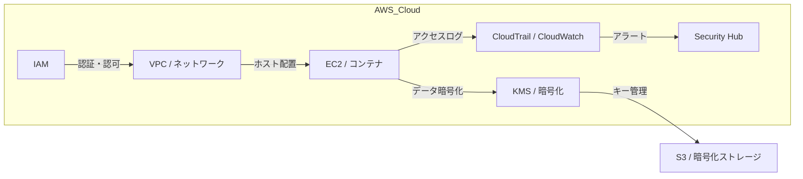

---

title: "クラウドセキュリティ"
description: "AWS基盤での脆弱性管理とIAM設計"
date: 2025-05-12
-------------------

## 概要

クラウドセキュリティカテゴリでは、AWS や GCP、Azure といったパブリッククラウド環境におけるセキュリティ対策を体系的に学びます。
ここでは、アイデンティティ／アクセス管理、ネットワーク設計、脆弱性スキャン、ログ・監視、暗号化、コンプライアンスなど、クラウドプラットフォームが提供する機能を活用した実践的な検証ラボを提供します。

## アーキテクチャ図

## 主なトピック

* **IAM（Identity and Access Management）**
  最小権限の原則に基づくアクセス制御ポリシーの設計と検証
* **ネットワークセキュリティ**
  VPC／サブネット設計、セキュリティグループ、NACL の設定
* **脆弱性管理**
  EC2／コンテナ／サーバレス環境でのスキャンと対応策
* **監視・ログ管理**
  CloudTrail、CloudWatch、Security Hub を用いたイベント集約とアラート
* **暗号化**
  KMS を利用したデータの静止時・転送時暗号化とキー管理
* **コンプライアンス**
  CIS ベンチマークや各種規制（PCI-DSS、GDPR）への適合性検証

## 学習の流れ

1. IAM ポリシーの作成とアクセス検証
2. VPC とサブネットのセキュアな構築
3. 脆弱性スキャンの実行とレポート分析
4. ログ集約とダッシュボード構築
5. KMS を用いた暗号化フロー実装
6. ハードニング演習と検証結果のドキュメント化

> **Note:** 次は各 Proof ラボに進み、AWS 上でのシナリオベース検証を通じて実践的スキルを身につけていきます。
