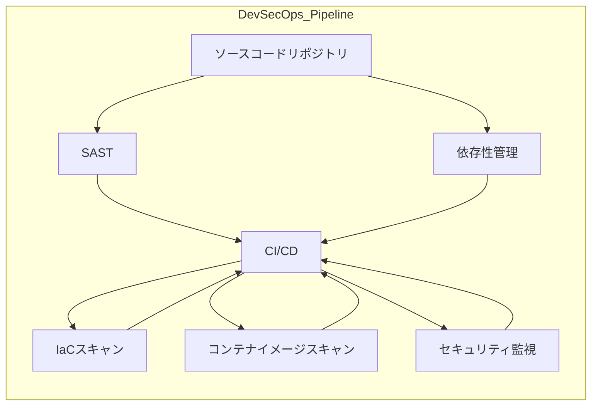

---

title: "DevSecOps"
description: "CI/CDパイプラインにおけるセキュリティ統合と自動化"
date: 2025-05-12
-------------------

## 概要

DevSecOpsカテゴリでは、開発プロセスの「シフトレフト」を実現し、継続的インテグレーション／デリバリー（CI/CD）パイプラインにセキュリティ検査と自動化を組み込む実践手法を学びます。
ここでは、コード静的解析、脆弱性スキャン、依存関係管理、コンテナ／インフラのセキュリティ自動化、ガバナンスとコンプライアンス適用を演習形式で提供します。

## アーキテクチャ図

## 主なトピック

* **シフトレフトセキュリティ**
  開発初期からのセキュリティ検査設計と実装
* **静的／動的解析 (SAST/DAST)**
  ソースコードや実稼働環境への自動分析導入
* **依存性管理**
  OSS脆弱性検出（Dependabot, Renovateなど）とライブラリ更新
* **インフラ／IaCセキュリティ**
  Terraform, CloudFormationの静的スキャンとベストプラクティス
* **コンテナ／イメージセキュリティ**
  Dockerイメージスキャン、脆弱性フィックス自動化
* **セキュリティ監視・アラート**
  パイプラインからSIEM連携、チャットOpsでの通知と対応

## 学習の流れ

1. セキュリティ要件定義とポリシー策定
2. SASTツール導入と初期ルール設定
3. 依存性脆弱性検出の自動化設定
4. IaCテンプレートの静的セキュリティスキャン
5. コンテナイメージスキャン演習
6. パイプライン内アラートの設計・通知フロー構築

> **Note:** 次はProofレイヤのDevSecOps演習に進み、実環境でのCI/CDセキュリティ統合を体験します。
