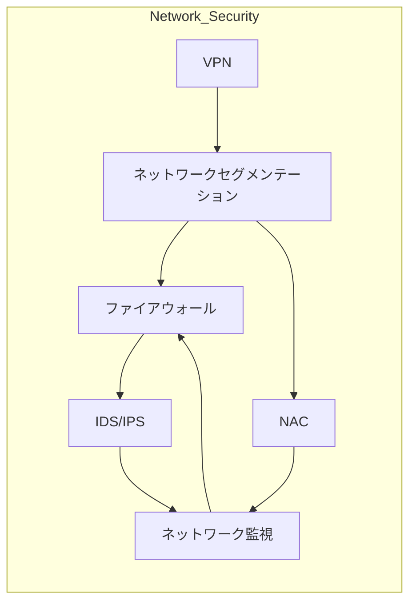

---

createDate: "2025-05-12"
title: "ネットワークセキュリティ"
description: "安全なネットワーク設計と運用、IDS/IPS、セグメンテーション、VPNなど"
date: "2025-05-12"
---------------------

## 概要

ネットワークセキュリティカテゴリでは、企業ネットワークやクラウド環境におけるセキュアな通信基盤の設計・運用手法を学びます。
ここでは、ネットワークセグメンテーション、ファイアウォール、IDS/IPS、VPN、ネットワークアクセス制御（NAC）、監視・ログ分析など、実践的なラボ演習を通じてセキュリティ要件を満たすネットワーク構築と運用を習得します。

## アーキテクチャ図

## 主なトピック

* **ネットワークセグメンテーション**
  VLANやサブネットによるゾーニング設計
* **ファイアウォール設計・運用**
  ステートフル／ステートレスルールとゾーンモデル
* **IDS/IPS導入とチューニング**
  シグネチャ／アノマリ検知とアラート最適化
* **VPN構築と認証**
  IPsec／SSL-VPN、MFA連携
* **ネットワークアクセス制御 (NAC)**
  802.1X認証やエンドポイント検証
* **トラフィック監視とログ分析**
  NetFlow、sFlow、Syslog収集による可視化

## 学習の流れ

1. ネットワークアーキテクチャのモデリングとゾーニング
2. VLAN・サブネット構成によるセグメンテーション実装
3. ファイアウォールルール設計とデプロイ
4. IDS/IPSの導入およびシグネチャチューニング
5. VPNソリューション導入と多要素認証設定
6. NACによる認証制御とポリシー適用
7. ネットワーク監視・ログ分析環境の構築

> **Note:** 次はProofレイヤのネットワークセキュリティ演習に進み、実運用を想定したシナリオでスキルを磨きます。
