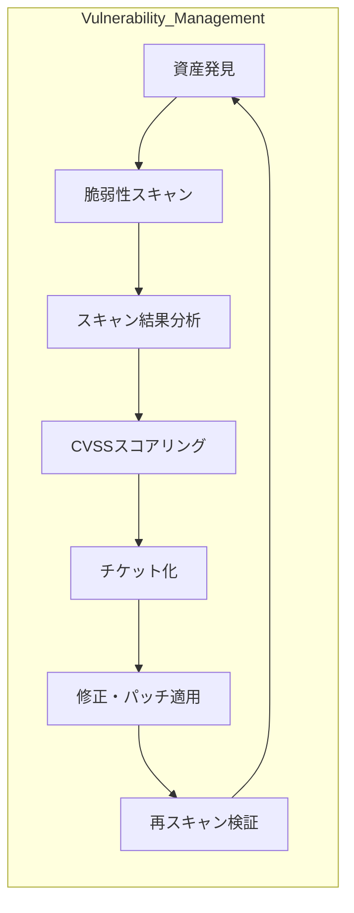

---

title: "脆弱性管理"
description: "ネットワーク、OS、アプリケーションにおける脆弱性評価と対応プロセス"
date: 2025-05-12
-------------------

## 概要

脆弱性管理カテゴリでは、脆弱性の発見から評価、優先順位付け、修正までの一連のプロセスを学びます。
ここでは、脆弱性スキャンツール（Nessus, OpenVAS, Qualysなど）の導入、スキャン結果の分析、CVSSスコアリング、チケット化と修正展開、再スキャンによる検証を通じて、組織的な脆弱性管理フレームワークを実践的に理解します。

## アーキテクチャ図

## 主なトピック

* **資産識別とインベントリ管理**
* **脆弱性スキャンツールの導入と設定**
* **スキャン結果のフィルタリングと優先順位付け**
* **CVSSを用いたリスク評価**
* **チケット化と変更管理フロー**
* **修正・パッチ適用とベリフィケーション**
* **レポーティングとダッシュボード**

## 学習の流れ

1. 資産発見とインベントリ構築
2. スキャンツール（Nessus/OpenVAS）の導入
3. 定期スキャンの実行と結果取得
4. CVSSスコアリングによる優先度分類
5. チケット作成と修正計画の策定
6. パッチ適用と修正完了検証
7. レポート作成と継続的改善

> **Note:** Proofレイヤの脆弱性管理演習に進み、実際のネットワーク環境を模したシナリオで運用スキルを習得します。
