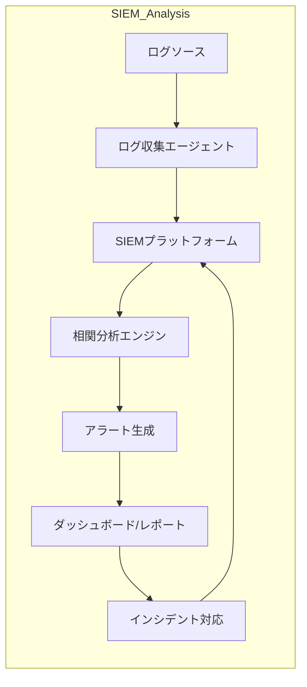

---

title: "ログ・SIEM分析"
description: "ログ収集からSIEMプラットフォームを用いた相関分析・可視化・アラート運用まで"
date: 2025-05-12
-------------------

## 概要

ログ・SIEM分析カテゴリでは、各種ログソースからのデータ収集を起点に、SIEM（Security Information and Event Management）プラットフォームを用いた相関分析、ダッシュボード可視化、アラート運用、インシデント対応までの一連の運用手法を学びます。
このセクションでは、ログ正規化や分析ルールの設計、効果的なダッシュボード構築、アラートチューニング、そしてフォレンジック／インシデント対応ワークフローを含む実践演習を提供します。

## アーキテクチャ図

## 主なトピック

* **ログ収集・正規化**
  各種ソース（OS, ネットワーク機器, アプリケーション）のログ取得と共通フォーマット化
* **相関分析ルール設計**
  脅威シナリオに基づくパターン検出とアラート条件の策定
* **ダッシュボード可視化**
  KPI／Triageビューの設計、時系列・ヒートマップ・地理情報の活用
* **アラート運用・チューニング**
  フォールスアラート削減、優先度設定、対応プロセス定義
* **フォレンジック・インシデント対応**
  アラートからのトリアージ、証跡調査、対応フロー実践
* **運用ベストプラクティス**
  スケーラビリティ、ログ保持ポリシー、コンプライアンス要件対応

## 学習の流れ

1. ログ収集エージェントのインストールと設定
2. ログ正規化ルール (CEF/ECSなど) の適用
3. 相関分析ルールの作成とテスト
4. ダッシュボードおよびレポートの構築
5. アラート設定とチューニング演習
6. インシデント対応シミュレーションとフォレンジック手順

> **Note:** 次は各 Proof ラボに進み、実環境を想定したSIEM分析シナリオで実践的スキルを習得します。
