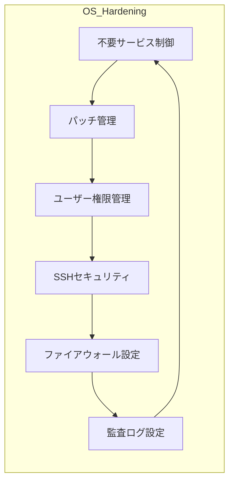

---

title: "OSハードニング"
description: "Linuxサーバを中心としたOSセキュリティ強化とベストプラクティス"
date: 2025-05-12
-------------------

## 概要

OSハードニングカテゴリでは、Linux（Ubuntu, CentOSなど）サーバにおけるセキュリティ強化手法を学びます。
ここでは、不要なサービスの無効化やパッケージ管理、ファイル権限の最適化、監査ログ設定、脆弱性スキャン、パッチ管理、SSHセキュリティなど実践的なハードニング手順を提供します。

## アーキテクチャ図

## 主なトピック

* **不要サービスの制御**
  systemctlやchkconfigで不要なサービスを停止・無効化
* **パッケージ管理とパッチ適用**
  yum/aptを用いた最新パッケージの適用と自動更新設定
* **ユーザー・グループ管理**
  sudo設定、不要ユーザーの削除、ファイルパーミッション最適化
* **SSHの強化**
  rootログイン禁止、公開鍵認証導入、ポート変更、Fail2Ban設定
* **ファイアウォール**
  iptables/nftablesでのインバウンド・アウトバウンド制御
* **監査ログ設定**
  auditdやsyslogでのログ収集、ログの保管と集中管理

## 学習の流れ

1. 初期OSセットアップと不要サービスの無効化
2. パッチ適用と自動更新の設定
3. ユーザー・グループおよびファイル権限の最適化
4. SSHアクセスのハードニング演習
5. ファイアウォールポリシーの設計と適用
6. 監査ログ収集環境の構築と確認

> **Note:** この後、ProofレイヤのOSハードニング演習に進み、実際のシナリオに基づく検証を行います。
