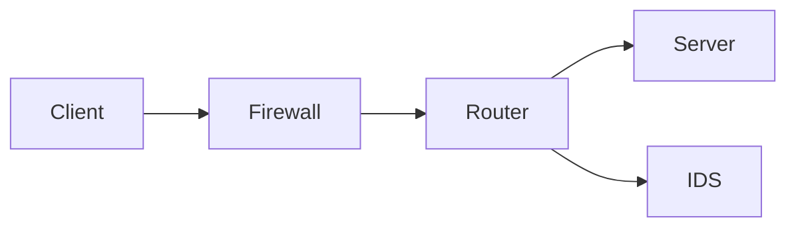

import ProofList from '@/components/molecules/ProofList.astro';

# 概要

ネットワークセキュリティカテゴリでは、企業ネットワークやクラウド環境における通信の安全性を確保する技術と手法を紹介します。このカテゴリのProofでは、パケットキャプチャ、ファイアウォール設定、侵入検知、VPN導入など、実務で頻出のシナリオを再現・解説します。

---

## 主な学習項目

- 🎯 **パケットキャプチャと解析**  
  - `tcpdump` / `Wireshark` を使ったライブキャプチャ  
  - ARP／DNS／HTTP トランザクションの可視化
- 🔥 **ファイアウォールとアクセス制御**  
  - iptables / nftables 基本ルール  
  - セキュリティグループによるクラウド制御
- 🛡️ **侵入検知システム（IDS）**  
  - Snort / Suricata のセットアップ  
  - アラートチューニング
- 🔒 **VPN とトンネリング**  
  - OpenVPN / WireGuard の構築  
  - トラフィック暗号化と認証方式

---

## 技術相関図

